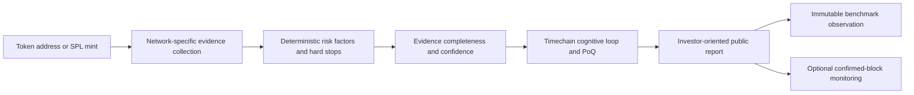

# Chainseer

Chainseer is an evidence-first on-chain risk analysis system for **Robinhood
Chain tokens**, **Base contracts**, and **Solana SPL mints**. It combines deterministic blockchain
and market checks with a tamper-evident Cypher Tempre Timechain, then presents
the result as an investor-oriented risk report with explicit hard stops,
unknowns, confidence, and provenance.

Chainseer is analysis and risk-management infrastructure. This repository does
**not** contain a wallet, private-key loader, transaction signer, or transaction
broadcast path.

## What Chainseer provides

- Robinhood Chain, Base, and Solana analysis through one authenticated API
- network-specific evidence collection instead of pretending both chains have
  identical security models
- investor-readable risk level, action, legitimacy score, confidence, market
  cap, holder evidence, red/yellow/green flags, and hard stops
- block- or slot-anchored on-chain observations with timestamped,
  content-addressed HTTP evidence
- a non-bypassable Timechain cognitive loop with executable senses,
  modalities, covenant screening, Proof of Qualia (PoQ), and sealed analysis
  history
- isolated confirmed-block monitoring and drift alerts for Robinhood Chain
  and Base contracts
- one-time pre-trade authorization artifacts with block freshness and
  executable-route guardrails—without signing or executing a trade
- append-only outcome collection and tighten-only calibration proposals
- automatic, version-pinned production benchmark capture

## How an analysis flows



The deterministic analyzer owns the score and hard-stop decision. The
cognitive layer can surface patterns, caveats, or capability gaps, but it
cannot lower deterministic risk thresholds or turn missing evidence into a
safety claim.

## Robinhood Chain analysis

Robinhood Chain reports are pinned to a confirmed block and combine independent
RPC, explorer, security-provider, and market observations where available.

The analyzer covers:

- bytecode, ownership, proxy, pausable, mint, blacklist, and transfer-control
  risks
- verified source-code status and deployer history through Blockscout
- honeypot and sell-restriction evidence
- buy/sell tax estimation and executable liquidity evidence
- canonical market discovery, reserves, liquidity, volume, age, market cap,
  price, and activity through DexScreener and on-chain calls
- LP custody using market-type-aware states; launchpad/platform-managed
  liquidity is distinguished from independently controlled unlocked LP
- holder adoption and supply concentration, with indexer-discovered balances
  revalidated by `balanceOf` at the pinned block and only independently
  identified AMM contracts excluded
- scam-flagged wallets, proxy-holder patterns, creator concentration, and
  serial-deployer signals
- wash-trading indicators, social-attention context, cross-chain provider
  attestations, MEV exposure, and historical Timechain trends

The composite model uses 12 bounded factors: security, honeypot safety,
liquidity, LP custody, holder distribution, volume, maturity, creator risk,
wash trading, deployer history, sentiment, and trend. A separate hard-stop
layer prevents a weighted average from hiding a loss-of-capital condition.

## Base analysis

Base uses the same production EVM evidence and scoring core as Robinhood Chain,
but every analyzer instance has an immutable Base profile: chain ID `8453`,
Base RPC, Base Blockscout, Base DexScreener markets, GoPlus chain scope, Base
WETH, explorer links, cache namespace, benchmark cohort, and watcher files.
This keeps scores comparable without allowing one network's data or protocol
assumptions to leak into another.

Base reports cover the full EVM factor set above. Protocol-specific evidence
fails closed when it cannot be verified on Base; unknown liquidity custody is
reported as `custody_unverified`, never silently converted into locked or
creator-withdrawable liquidity. The default public Base RPC is rate-limited,
so production operators should set `CHAINSEER_BASE_RPC_URL` to a dedicated
HTTPS endpoint.

## Solana analysis

Solana uses its own conservative evidence model. It does not translate EVM
ownership or LP-lock assumptions onto SPL tokens.

The analyzer covers:

- confirmed starting-slot anchor and observation hashes
- mint authority, freeze authority, supply, decimals, and risky token
  extensions
- largest-account concentration relative to total supply
- canonical Solana market, liquidity, market age, price, volume, transaction
  activity, and market cap through DexScreener
- Jupiter token metadata and bounded two-way route evidence
- round-trip retention, price impact, and route availability

Generic SPL scans do not claim creator attribution, pool-vault custody, or
wash-trading detection unless those facts are independently verified.
Largest-account data may include AMM or program vaults, so Chainseer reports
that limitation instead of presenting it as certain holder ownership.
Provider/RPC failure is classified as **infrastructure indeterminate**, not as
negative token evidence.

## Entity and insider evidence graph

Every analysis now projects its verified and provider-attested entities into a
deterministic graph. It connects the analyzed asset to deployers, reported
owners, proxy implementations, primary markets, LP withdrawal controllers, top
holders, Solana authorities, token accounts, and resolved account owners.

Each relationship carries an evidence status, confidence, fact references, and
bounded attributes. Chainseer surfaces exact-address role overlaps, privileged
supply concentration, direct liquidity control, serial deployers, scam-flagged
entities, provider disagreement, proxy holders, and Solana authority/account
overlaps.

The graph is deliberately conservative:

- ordinary large holders are not labelled insiders without a privileged link
- shared funding and behavioral wallet clusters remain unmeasured
- Solana AMM/program vaults remain unresolved until independently identified
- graph v1 is evidence-only and does not silently change the legitimacy score

The canonical graph hash, summary, and signals are included in Timechain
sealing. The authenticated API returns the bounded nodes and edges for future
visualization. See [`ENTITY_GRAPH.md`](ENTITY_GRAPH.md) for the schema,
relationship semantics, signal definitions, and limitations.

## Timechain cognitive provenance

Every completed analysis passes through the Cypher Tempre self-model:

1. relevant prior rings are recalled;
2. executable senses and modalities inspect the structured evidence;
3. the covenant membrane checks safety and grounding;
4. PoQ decides whether the cognition is sufficiently supported to seal;
5. analysis and cognitive-completion evidence are appended to a hash-linked
   Timechain ring.

Production also installs the reviewed
[`chainseer-production-risk-lenses`](faculties/chainseer-production-v1.json)
pack before Recall is initialized. Its 12 bounded faculties cover liquidity
custody, holder-concentration basis, authority state, proxy upgrades,
sellability, and infrastructure indeterminacy. The pack is canonical-hash
verified, immune-screened, imported once, and anchored by a registry epoch.
It transfers capability definitions only—no developer Timechain history is
copied into production.

The result is tamper-evident and internally consistent: later verification can
detect modified, removed, reordered, or incompatible rings and faculty
registries. Timechain verification does not claim that a historical external
API response can always be reproduced from its present-day endpoint.

When a genuine capability gap is detected, Cambium may grow a constrained
primitive faculty and seal a new registry epoch. Growth is fail-closed and
cannot silently change deterministic scoring policy.

The public report exposes an expandable **Cognitive trace** with the active
senses, reasoning modalities, bounded recall references, growth events, PoQ
completion state, and cognitive ring. This is provenance and observability,
not a second scoring engine: deterministic evidence and hard-stop rules remain
authoritative, and the cognitive layer has no signing or broadcast capability.

## Monitoring and pre-trade controls

`chainseer_controls.py` extends all network analyzers with:

- confirmed-block watching for owner, proxy, transfer, LP-burn, holder, and
  outcome changes
- reorg detection and state-drift alerts
- confirmed Solana signature indexing plus compact mint-authority, supply,
  extension, holder-concentration, primary-market, liquidity, and price
  transition detection
- event-triggered Solana rescans with noisy activity debounced and a periodic
  reconciliation scan to recover from missed provider events
- Timechain-sealed critical alerts for liquidity removal or custody
  deterioration, privileged-authority changes, proxy implementation upgrades,
  and newly unsafe sellability, tax, or Jupiter route conditions
- a subscriber-isolated, cursor-based critical-alert feed; subscriber
  identities are one-way hashes and raw watcher state is not exposed
- outcome checks at 1 hour, 6 hours, 24 hours, 7 days, and 30 days
- calibration proposals that can only tighten the adopted pre-trade policy
- short-lived, one-time `TradePermit` artifacts bound to the current block,
  token, canonical pair, input amount, recipient, and executable quote
- slippage, price-impact, route, MEV, expiry, replay, and hard-stop rejection

A `TradePermit` is an authorization artifact for a separate execution adapter.
It is not a signed transaction and cannot move funds. See
[`CHAINSEER_CONTROLS.md`](CHAINSEER_CONTROLS.md) for commands and safety
invariants.

## Benchmark

Chainseer includes a time-separated benchmark designed to measure what the
analyzer knew **before** an outcome occurred.

Production automatically captures one immutable observation for every fresh
successful Robinhood, Base, or Solana analysis. Cache hits are not duplicated.
Observations are:

- pinned to the exact deployed Git commit
- assigned deterministically to train (60%), validation (20%), or test (20%)
  so the same token never leaks across splits
- stored separately from later, independently reviewed outcomes
- classified so infrastructure failure is not confused with token risk

Benign labels require at least seven days of outcome evidence. Reports measure
dangerous false negatives, false positives, precision, recall, specificity,
abstention, infrastructure handling, latency, evidence freshness, confidence
intervals, and optional probability calibration. Analyzer comparisons are
valid only for matched cases with the same evidence cutoff.

The benchmark currently provides the capture, validation, materialization, and
evaluation system. It does **not** claim production accuracy until enough
time-separated, independently reviewed cases mature. Full schema, commands,
metrics, and comparison rules are documented in
[`BENCHMARK.md`](BENCHMARK.md).

## API

The FastAPI service uses bearer authentication, per-client rate limits, a
bounded single-worker queue, network-aware caching, request-size limits,
trusted-host/CORS policy, and a single-process Timechain lease.

### Submit an analysis

```bash
curl -X POST "http://127.0.0.1:8000/v1/analyses" \
  -H "Authorization: Bearer $CHAINSEER_API_TOKEN" \
  -H "Content-Type: application/json" \
  -d '{"network":"robinhood","address":"0xYourTokenAddress"}'
```

```bash
curl -X POST "http://127.0.0.1:8000/v1/analyses" \
  -H "Authorization: Bearer $CHAINSEER_API_TOKEN" \
  -H "Content-Type: application/json" \
  -d '{"network":"base","address":"0xYourBaseTokenAddress"}'
```

```bash
curl -X POST "http://127.0.0.1:8000/v1/analyses" \
  -H "Authorization: Bearer $CHAINSEER_API_TOKEN" \
  -H "Content-Type: application/json" \
  -d '{"network":"solana","address":"YourSolanaMint"}'
```

The API returns `202 Accepted` and a job ID. Poll the job until it succeeds:

```bash
curl "http://127.0.0.1:8000/v1/analyses/JOB_ID" \
  -H "Authorization: Bearer $CHAINSEER_API_TOKEN"
```

### Endpoints

| Method | Endpoint | Purpose |
| --- | --- | --- |
| `GET` | `/health/live` | Process liveness |
| `GET` | `/health/ready` | Worker, watcher, network, and benchmark readiness |
| `POST` | `/v1/analyses` | Submit a Robinhood, Base, or Solana analysis |
| `GET` | `/v1/analyses/{job_id}` | Retrieve job state and public report |
| `GET` | `/v1/watch` | Inspect the authenticated client's watch state |
| `POST` | `/v1/watch` | Add an idempotent, client-aware watch subscription |
| `GET` | `/v1/watch/alerts` | Read bounded critical alerts after an ISO cursor |
| `DELETE` | `/v1/watch/{address}` | Remove only the authenticated client's subscription |

## Run locally

Prerequisites:

- Python 3.11 or newer
- an installed Cypher Tempre self-model skill
- `CHAINSEER_SKILL_DIR` pointing to that skill directory
- HTTPS RPC endpoints for the networks you want to analyze

Install the API dependencies and run the test suite:

```bash
python -X utf8 -m pip install -r requirements-api.txt
python -X utf8 -m unittest discover -s tests -v
```

Run the Robinhood Chain CLI:

```bash
python -X utf8 chainseer.py 0xYourTokenAddress
python -X utf8 chainseer.py 0xYourTokenAddress --full
```

Run the API locally:

```bash
export CHAINSEER_SKILL_DIR="/path/to/cypher-tempre-self-model"
export CHAINSEER_API_TOKEN="replace-with-a-long-random-development-token"
export CHAINSEER_BASE_RPC_URL="https://your-base-rpc.example"
export CHAINSEER_SOLANA_RPC_URL="https://your-solana-rpc.example"
python -X utf8 chainseer_api.py
```

Development API documentation is available at `http://127.0.0.1:8000/docs`.
Interactive docs are disabled in production.

## Production architecture

- one Fly.io application instance in Frankfurt
- one bounded analysis worker and confirmed-block watcher
- persistent disk mounted at `/data`
- one filesystem lease and one ordered Timechain writer
- Timechain and benchmark storage survive deploys and restarts
- Cypher Tempre runtime pinned to an exact source revision
- faculty-registry epoch verification at startup
- public reports omit raw upstream responses and internal query parameters
- cognition receives trusted structured fields, never raw provider bodies

Do not horizontally scale the current filesystem-backed Timechain. Multiple
writers require a coordinated consensus or transactional append design.
Deployment, secrets, backups, health checks, and domain setup are covered in
[`API_DEPLOYMENT.md`](API_DEPLOYMENT.md).

## Repository guide

| File | Responsibility |
| --- | --- |
| [`chainseer.py`](chainseer.py) | Network-configurable production EVM analyzer and report model |
| [`chainseer_base_public.py`](chainseer_base_public.py) | Isolated first-class Base adapter |
| [`chainseer_solana_public.py`](chainseer_solana_public.py) | Conservative Solana analyzer |
| [`chainseer_api.py`](chainseer_api.py) | Authenticated FastAPI service, queue, cache, watcher integration, and production benchmark capture |
| [`chainseer_controls.py`](chainseer_controls.py) | Monitoring, outcomes, calibration, MEV checks, and TradePermit boundary |
| [`chainseer_benchmark.py`](chainseer_benchmark.py) | Immutable case bank and deterministic benchmark evaluator |
| [`chainseer_entity_graph.py`](chainseer_entity_graph.py) | Deterministic entity relationships, insider-exposure signals, and graph verification |
| [`CHAINSEER_CONTROLS.md`](CHAINSEER_CONTROLS.md) | Monitoring and pre-trade control operations |
| [`BENCHMARK.md`](BENCHMARK.md) | Benchmark schema, workflow, metrics, and caveats |
| [`ENTITY_GRAPH.md`](ENTITY_GRAPH.md) | Entity graph schema, evidence semantics, signals, and inference limits |
| [`API_DEPLOYMENT.md`](API_DEPLOYMENT.md) | Fly.io deployment and production operations |
| [`render.yaml`](render.yaml) | Render Blueprint |
| [`Dockerfile.api`](Dockerfile.api) | Reproducible API container |

## Safety and interpretation

- A high score is not a guarantee of safety, liquidity, or future return.
- Missing or stale evidence lowers confidence; it is never silently converted
  into a green flag.
- Social attention is manipulable and cannot override a hard stop.
- Market performance and security correctness are tracked separately.
- Re-run the analysis immediately before any action because ownership,
  liquidity, holders, routes, and market state can change.
- This software is research and decision-support infrastructure, not financial
  advice.

Never commit API tokens, private keys, environment files, local Timechain
rings, learning databases, benchmark ledgers, or analysis reports.
